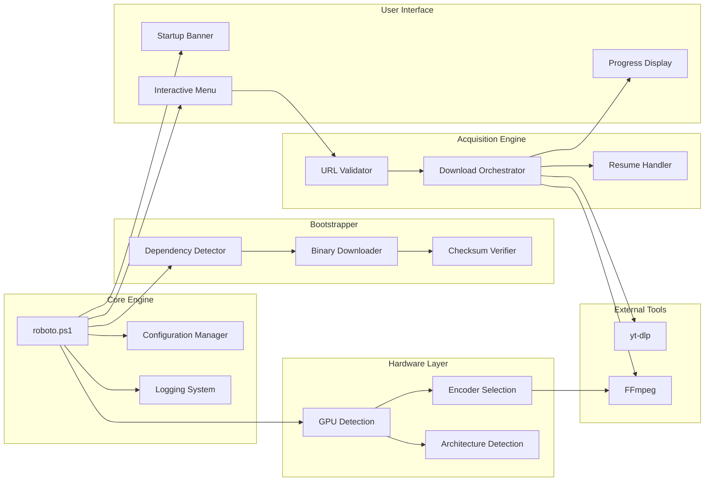
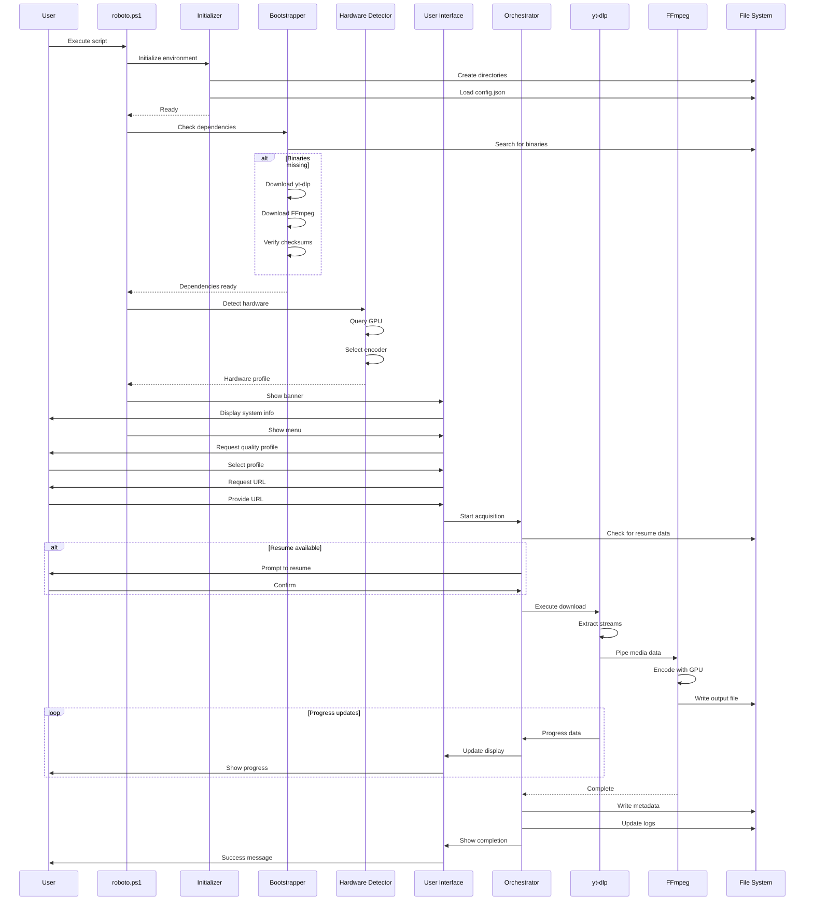
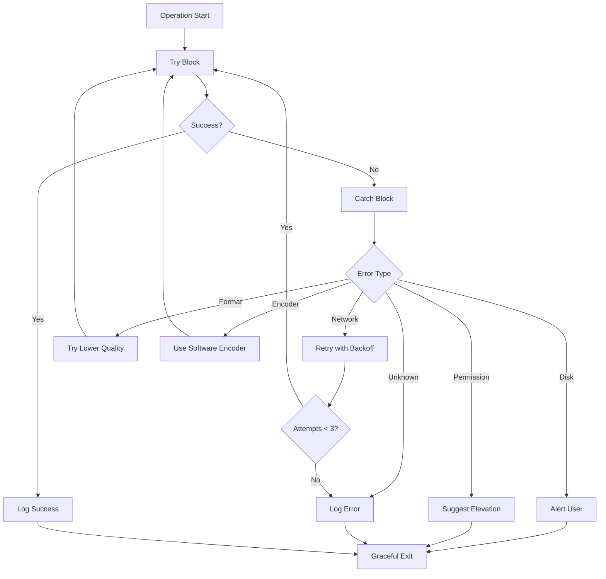

# Mr. Roboto v2.0 - System Architecture

## High-Level Architecture

```mermaid
graph TB
    User[User] -->|Executes| Main[roboto.ps1]
    Main -->|Initializes| Init[Initialize-Environment]
    Main -->|Loads| Config[config.json]
    Main -->|Displays| Banner[Show-Banner]
    
    Init -->|Creates| Dirs[Directory Structure]
    Init -->|Starts| Logger[Logging System]
    
    Main -->|Checks| Deps[Check Dependencies]
    Deps -->|Missing?| Bootstrap[Install-Dependencies]
    Bootstrap -->|Downloads| YTDLP[yt-dlp.exe]
    Bootstrap -->|Downloads| FFmpeg[ffmpeg.exe]
    
    Main -->|Detects| GPU[Get-HardwareCapabilities]
    GPU -->|NVIDIA| NVENC[h264_nvenc]
    GPU -->|Intel| QSV[h264_qsv]
    GPU -->|AMD| AMF[h264_amf]
    GPU -->|None| SW[libx264]
    
    Main -->|Shows| Menu[Interactive Menu]
    Menu -->|Select| Profile[Quality Profile]
    Menu -->|Input| URL[Media URL]
    
    Profile -->|Ultra| P1[4K MKV]
    Profile -->|High| P2[1080p MP4]
    Profile -->|Mobile| P3[720p MP4]
    
    URL -->|Validates| Validate[Test-MediaUrl]
    Validate -->|Valid| Download[Start-MediaAcquisition]
    
    Download -->|Executes| YTDLP
    YTDLP -->|Streams to| FFmpeg
    FFmpeg -->|Encodes with| NVENC
    FFmpeg -->|Outputs| Output[/downloads/]
    
    Download -->|Tracks| Progress[Show-Progress]
    Download -->|Logs| Logger
    Download -->|Saves State| State[/state/session.json]
    
    Progress -->|Updates| Console[Terminal Display]
```

## Component Architecture



## Data Flow



## Module Breakdown

### 1. Core Engine (`roboto.ps1`)

**Responsibilities:**
- Application entry point
- Module orchestration
- Configuration management
- Session lifecycle
- Cross-platform OS detection

**Key Functions:**
- `Main()` - Entry point (includes PS7 version guard on Linux)
- `Initialize-Environment()` - Setup
- `Get-Config()` - Load configuration
- `Set-Config()` - Save configuration

**Platform shim** — defined at startup, safe for PS5.1:
```powershell
if ($null -eq (Get-Variable 'IsWindows' -ErrorAction SilentlyContinue)) {
    New-Variable -Name IsWindows -Value $true  -Scope Script -Force
    New-Variable -Name IsLinux   -Value $false -Scope Script -Force
    New-Variable -Name IsMacOS   -Value $false -Scope Script -Force
}
```

### 2. Bootstrapper Module

**Responsibilities:**
- Dependency detection (cross-platform binary names)
- Binary acquisition (zip on Windows, tar.xz on Linux)
- Architecture-aware URL selection
- Version management

**Key Functions:**
- `Get-ArchInfo()` - Returns `{ Arch, ConfigKey }` — single source of truth for platform/arch
- `Find-Binary($Name)` - Locate executable (no `.exe` on Linux)
- `Install-Dependencies()` - Download binaries
- `Install-Binary($Name)` - Platform-branched download and extraction

### 3. Hardware Detection Module

**Responsibilities:**
- GPU enumeration (WMI on Windows, `nvidia-smi`/`lspci` on Linux)
- Encoder selection (encoder names differ by platform for AMD)
- Architecture detection
- Capability profiling

**Key Functions:**
- `Get-HardwareCapabilities()` - Full hardware scan (cross-platform)
- `Get-ArchInfo()` - CPU architecture detection

**Encoder mapping:**

| GPU | Windows | Linux |
|-----|---------|-------|
| NVIDIA | `h264_nvenc` | `h264_nvenc` |
| Intel | `h264_qsv` | `h264_qsv` |
| AMD | `h264_amf` | `h264_vaapi` |
| None | `libx264` | `libx264` |

### 4. User Interface Module

**Responsibilities:**
- Terminal rendering
- User input handling
- Progress visualization
- Status messaging

**Key Functions:**
- `Show-Banner()` - Display startup banner
- `Show-Menu($Options)` - Interactive menu
- `Show-Progress($Data)` - Progress bar
- `Write-Status($Message, $Level)` - Status output

### 5. Acquisition Engine Module

**Responsibilities:**
- URL validation
- Download orchestration
- Process management
- State persistence

**Key Functions:**
- `Test-MediaUrl($Url)` - Validate URL
- `Start-MediaAcquisition($Url, $Profile)` - Main download
- `Build-YtdlpCommand($Params)` - Command builder
- `Invoke-Download($Command)` - Execute download

### 6. Logging Module

**Responsibilities:**
- Log file management
- Message formatting
- Log rotation
- Error tracking

**Key Functions:**
- `Write-Log($Message, $Level)` - Log entry
- `New-LogSession()` - Create log file
- `Get-LogHistory()` - Retrieve logs
- `Clear-OldLogs($Days)` - Cleanup

### 7. Resume Handler Module

**Responsibilities:**
- State tracking
- Resume detection
- Checkpoint management
- Recovery coordination

**Key Functions:**
- `Save-DownloadState($Data)` - Persist state
- `Get-DownloadState()` - Load state
- `Test-ResumeAvailable()` - Check for resume
- `Resume-Download($StateData)` - Continue download

## File System Layout

```
/MrRoboto/
│
├── roboto.bat                      # Windows launcher
├── roboto.sh                       # Linux/macOS launcher (requires pwsh)
├── roboto.ps1                      # Main entry point (~1100 lines, cross-platform)
│   ├── Main()
│   ├── Get-ArchInfo()              # Platform/arch helper
│   ├── Get-DefaultCookieBrowser()  # OS-aware browser detection
│   ├── Initialize-Environment()
│   ├── Install-Dependencies()
│   ├── Get-HardwareCapabilities()  # WMI on Windows, nvidia-smi/lspci on Linux
│   ├── Show-Banner()
│   ├── Show-Menu()
│   ├── Start-MediaAcquisition()
│   └── [All core functions]
│
├── config.json                     # Configuration file
│   ├── version
│   ├── settings
│   ├── profiles
│   └── binaries                   # Keyed by x64/x86/linux-x64/linux-arm64
│
├── /bin/                           # Binaries (auto-managed)
│   ├── /x64/
│   │   ├── yt-dlp.exe             # Windows 64-bit
│   │   ├── yt-dlp                 # Linux x86_64
│   │   ├── ffmpeg.exe             # Windows 64-bit
│   │   ├── ffmpeg                 # Linux x86_64
│   │   └── ffprobe / ffprobe.exe
│   ├── /x86/                      # Windows 32-bit only
│   │   └── yt-dlp.exe / ffmpeg.exe
│   └── /arm64/                    # Linux ARM64 (e.g. Raspberry Pi)
│       └── yt-dlp / ffmpeg
│
├── /downloads/                     # Output directory
│   └── [Media files]
│
├── /metadata/                      # Sidecars (Phase 3)
│   └── [JSON files]
│
├── /logs/                          # Session logs
│   ├── session_20260130_213000.log
│   └── [Historical logs]
│
├── /state/                         # Resume data
│   └── session.json
│
└── /cache/                         # Temporary files
    └── [Temp artifacts]
```

## Configuration Schema

```json
{
  "version": "2.0.0",
  "settings": {
    "defaultQuality": "high",
    "autoUpdate": true,
    "offlineMode": false,
    "notifications": true,
    "preferredContainer": "mp4",
    "libraryMode": false
  },
  "profiles": {
    "ultra":      { "format": "bestvideo[height<=2160]+bestaudio/best", "container": "mkv" },
    "high":       { "format": "bestvideo[height<=1080]+bestaudio/best", "container": "mp4" },
    "mobile":     { "format": "bestvideo[height<=720]+bestaudio/best",  "container": "mp4" },
    "audio-flac": { "audioOnly": true, "audioFormat": "flac" },
    "audio-opus": { "audioOnly": true, "audioFormat": "opus" },
    "audio-mp3":  { "audioOnly": true, "audioFormat": "mp3", "audioQuality": "320K" }
  },
  "binaries": {
    "yt-dlp": {
      "x64":         "https://github.com/yt-dlp/yt-dlp/releases/latest/download/yt-dlp.exe",
      "x86":         "https://github.com/yt-dlp/yt-dlp/releases/latest/download/yt-dlp_x86.exe",
      "linux-x64":   "https://github.com/yt-dlp/yt-dlp/releases/latest/download/yt-dlp_linux",
      "linux-arm64": "https://github.com/yt-dlp/yt-dlp/releases/latest/download/yt-dlp_linux_aarch64"
    },
    "ffmpeg": {
      "x64":         "https://github.com/BtbN/FFmpeg-Builds/releases/download/latest/ffmpeg-master-latest-win64-gpl.zip",
      "x86":         "https://github.com/BtbN/FFmpeg-Builds/releases/download/latest/ffmpeg-master-latest-win32-gpl.zip",
      "linux-x64":   "https://github.com/BtbN/FFmpeg-Builds/releases/download/latest/ffmpeg-master-latest-linux64-gpl.tar.xz",
      "linux-arm64": "https://github.com/BtbN/FFmpeg-Builds/releases/download/latest/ffmpeg-master-latest-linuxarm64-gpl.tar.xz"
    }
  }
}
```

`Get-ArchInfo` maps the current runtime to the correct config key:
- Windows x64 → `x64`
- Windows x86 → `x86`
- Linux x86_64 → `linux-x64`
- Linux aarch64 → `linux-arm64`

## State Management

### Session State (`/state/session.json`)

```json
{
  "sessionId": "20260130_213000",
  "url": "https://youtube.com/watch?v=dQw4w9WgXcQ",
  "profile": "high",
  "status": "in_progress",
  "progress": 0.45,
  "bytesDownloaded": 94371840,
  "totalBytes": 209715200,
  "speed": 2621440,
  "eta": 44,
  "encoder": "h264_nvenc",
  "outputPath": "downloads/Rick Astley - Never Gonna Give You Up.mp4",
  "timestamp": "2026-01-30T21:35:00Z",
  "partFile": "downloads/Rick Astley - Never Gonna Give You Up.mp4.part"
}
```

## Error Handling Strategy



## Performance Considerations

### Optimization Targets

| Component | Target | Strategy |
|-----------|--------|----------|
| Startup | < 3s | Lazy loading, cached detection |
| Binary Download | < 60s | Parallel downloads, resume support |
| GPU Detection | < 1s | WMI query optimization |
| Progress Update | 10 Hz | Throttled console writes |
| Log Writing | Async | Buffered I/O |

### Memory Management

- Stream processing (no full file buffering)
- Lazy module loading
- Periodic cache cleanup
- Log rotation (30-day retention)

### Network Optimization

- Resume-capable downloads
- Exponential backoff on failures
- Connection pooling
- Parallel chunk downloads (future)

## Security Model

### Input Validation

```powershell
# URL validation
function Test-MediaUrl {
    param([string]$Url)
    
    # Regex validation
    if ($Url -notmatch '^https?://[^\s]+$') {
        return $false
    }
    
    # Blacklist check
    $blacklist = @('file://', 'javascript:', 'data:')
    foreach ($pattern in $blacklist) {
        if ($Url -like "*$pattern*") {
            return $false
        }
    }
    
    return $true
}
```

### File System Safety

- Path sanitization
- Directory traversal prevention
- Write permission validation
- Disk space checks

### Binary Verification

- SHA-256 checksum validation
- Official source downloads only
- Version pinning support
- Signature verification (future)

## Extensibility Points

### Plugin Architecture (Future)

```powershell
# Plugin interface
interface IPlugin {
    [string] GetName()
    [void] OnInit($Context)
    [void] OnPreDownload($Url, $Profile)
    [void] OnPostDownload($OutputPath)
    [void] OnError($Exception)
}
```

### Custom Profiles

Users can add custom profiles to `config.json`:

```json
{
  "profiles": {
    "research": {
      "format": "bestvideo+bestaudio",
      "container": "mkv",
      "videoCodec": "copy",
      "audioCodec": "copy",
      "metadata": true,
      "thumbnail": true
    }
  }
}
```

### Event Hooks (Phase 4)

```powershell
# Event system
Register-Event -SourceIdentifier "DownloadComplete" -Action {
    param($OutputPath)
    # Custom post-processing
}
```

## Testing Strategy

### Unit Tests

```powershell
Describe "GPU Detection" {
    It "Should detect NVIDIA GPU" {
        Mock Get-CimInstance { @{ Name = "NVIDIA GeForce RTX 3050" } }
        $result = Get-HardwareCapabilities
        $result.Encoder | Should -Be "h264_nvenc"
    }
}
```

### Integration Tests

- Full download workflow
- Resume functionality
- Error recovery
- Multi-profile testing

### Performance Tests

- Startup time benchmarks
- Download speed measurements
- Memory usage profiling
- CPU utilization tracking

## Deployment Model

### Portable Deployment

```
1. Download MrRoboto.zip
2. Extract to any location
3. Run roboto.ps1
4. Done!
```

### No Installation Required

- Self-contained binaries
- No registry modifications
- No system PATH changes
- No admin privileges needed

### Update Mechanism

```powershell
# Auto-update check
if ($config.settings.autoUpdate) {
    $latest = Get-LatestVersion "yt-dlp"
    if ($latest -gt $current) {
        Update-Binary "yt-dlp"
    }
}
```

## Monitoring & Observability

### Logging Levels

| Level | Use Case | Example |
|-------|----------|---------|
| DEBUG | Development | Variable values, flow control |
| INFO | Normal ops | Download started, completed |
| WARN | Recoverable | Retry attempt, fallback used |
| ERROR | Failures | Download failed, missing file |

### Metrics (Future)

- Download success rate
- Average download speed
- Encoder usage distribution
- Error frequency by type

### Health Checks

```powershell
function Test-SystemHealth {
    @{
        BinariesPresent = (Test-Path $ytdlpPath) -and (Test-Path $ffmpegPath)
        DiskSpaceAvailable = (Get-PSDrive C).Free -gt 1GB
        NetworkConnected = Test-Connection "8.8.8.8" -Quiet
        GpuDetected = $null -ne (Get-GpuInfo)
    }
}
```

---

## Conclusion

This architecture provides:

- **Modularity** - Clear separation of concerns
- **Extensibility** - Plugin system and event hooks
- **Reliability** - Comprehensive error handling
- **Performance** - Optimized for speed and efficiency
- **Maintainability** - Well-documented, testable code

The design supports the current MVP scope while enabling future enhancements through well-defined extension points.